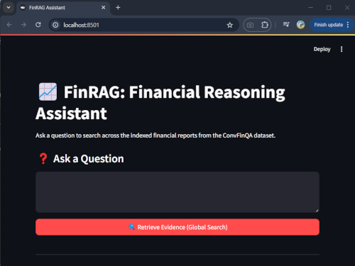

# FinRAG: Financial Reasoning Assistant

FinRAG is a Retrieval-Augmented Generation (RAG) system tailored for quantitative reasoning over financial reports, built on the ConvFinQA dataset. It orchestrates evidence retrieval, DSL planning, and numeric execution to answer complex questions.



## RAG Pipeline Overview

The following diagram illustrates the core workflow of FinRAG:

```
+-----------------------+      +-------------------------------------+      +------------------+
|    Question Input     | ---> |      Retriever (ChromaDB Primary)   | ---> |     Reranker     |
|      (Streamlit)      |      |      (Optional BM25 Fallback)       |      |   (Cohere API)   |
+-----------------------+      +-------------------------------------+      +------------------+
                                                                                     |
                                                                                     v
+------------------------------------+      +---------------------------------------------+
| Agent - Step 1: Specify Expression | ---> | Agent - Step 2: Extract Values (with Scale) |
|  (LLM: Required Items + Template)  |      |        (LLM: Finds Numbers in Evidence)     |
+------------------------------------+      +---------------------------------------------+
               |                                                |                      
               | (Template + Item Map)                          | (Extracted Numbers)  
               +------------------------------------------------+                      
                                      |
                                      v                      
                          +--------------------------+                     
                          | Executor (Python eval()) |                     
                          | Substitutes & Calculates |                     
                          +--------------------------+                     
                                      |
                                      v                      
                          +--------------------------+                     
                          |   Final Answer + Details |
                          |  (Formatted + Intermediates)|                     
                          +--------------------------+                     
```

For a detailed explanation of the system architecture, data flow, and component interactions, please refer to the [Design & Architecture Document](docs/design_architecture.md).

## Models

### OPENAI_CHAT_MODEL

Default: `gpt-4o-mini` (or the latest recommended mini version)
Used by the LLM agent (`src/finrag/agent.py`) for the two-step process:
1.  **Specify Expression**: Determines required financial items, maps them to placeholders, generates a Python expression template, and specifies the output format.
2.  **Extract Values**: Extracts numerical values for required items from the evidence, applying scaling as needed.

Selected for its strong reasoning, instruction following, function-calling capabilities (though currently using Python execution), and excellent balance of cost, latency, and performance.

### EMBEDDING_MODEL

Default: `text-embedding-ada-002`
Employed by `src/finrag/embeddings.py` to compute semantic embeddings for text and table chunks stored in ChromaDB. Chosen for high-quality embeddings suitable for semantic search, efficient performance, and cost-effectiveness for indexing financial documents.

These model identifiers can be customised in your `.env` file (referencing `OPENAI_CHAT_MODEL` and `EMBEDDING_MODEL` variables) to experiment with different compatible models.

## Documentation
FinRAG's supplementary guides and logs are available in the `docs/` folder:

| Document                   | Path                                    | Description                                           |
|----------------------------|-----------------------------------------|-------------------------------------------------------|
| Product Requirements (PRD) | [docs/PRD.md](docs/PRD.md)              | Objectives, features, non-functional requirements     |
| Design & Architecture      | [docs/design_architecture.md](docs/design_architecture.md) | System design, data flow, component overview          |
| Engineering Log            | [docs/engineering_log.md](docs/engineering_log.md)         | Development milestones, decisions, challenges         |
| Evaluation                 | [docs/evaluation.md](docs/evaluation.md)                   | Evaluation metrics, CLI usage, sample outputs         |
| Production Planning        | [docs/productionisation_plan.md](docs/productionisation_plan.md) | Production readiness, observability, cost strategies  |
| Requirements & Setup       | [docs/requirements_setup.md](docs/requirements_setup.md)   | Setup guide: dependencies, env vars, directory layout |
| Streamlit UI Walkthrough   | [docs/streamlit_ui_walkthrough.md](docs/streamlit_ui_walkthrough.md) | Streamlit interface guide with screenshots            |
| Test Suite Summary         | [docs/test_suite_summary.md](docs/test_suite_summary.md)   | Automated test overview: coverage, mocks, outputs     |
| Alternate PRD (prd2)       | [docs/prd2.md](docs/prd2.md)                 | (Potentially alternate or draft PRD version)          |


## Dataset
This project uses data from the ConvFinQA dataset, which provides conversational question-answer pairs over financial documents.

Download it from: [https://github.com/czyssrs/ConvFinQA](https://github.com/czyssrs/ConvFinQA)

## Example Questions

Here are a few examples of the types of financial reasoning questions FinRAG can handle:

- what is the percentage change in the total gross amount of unrecognized tax benefits from 2013 to 2014?
- what is the percentage change net provision for interest and penalties from 2015 to 2016?
- how much more return was given for investing in the overall market rather than applied materials from 2009 to 2014 ?

## Running Tests

```bash
poetry run pytest
```
See the [Test Suite Summary](docs/test_suite_summary.md) for further details about tests.

## Evaluation

```bash
poetry run python src/finrag/eval.py --split dev --sample 5
```
See the [Evaluation](docs/evaluation.md) section for details about the evaluation methodology.
