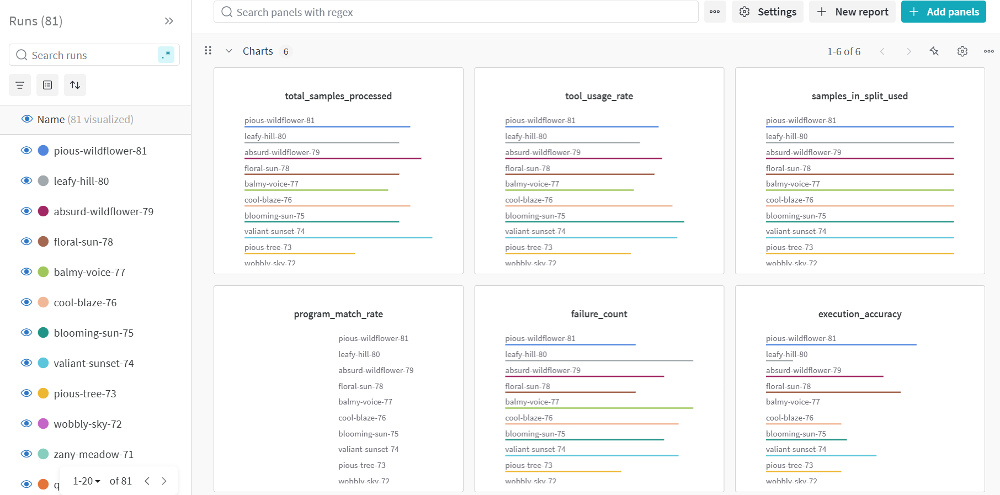
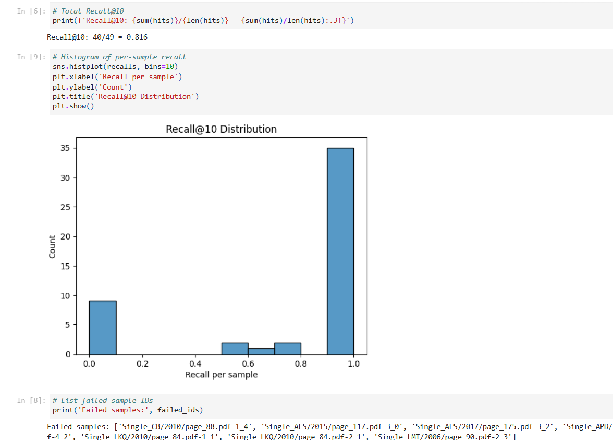

# FinRAG – System Evaluation Report

## 1. Overview

This document presents a structured analysis of the FinRAG system's performance based on evaluations conducted throughout the one-week development cycle. It details the evaluation methodology, key metrics, performance evolution tracked via Weights & Biases (W&B), common error patterns observed in the final RAG pipeline (ChromaDB retriever + two-step agent), and illustrative examples. This report serves to quantify the system's capabilities and limitations as of the final prototype state.

---

## 2. Evaluation Objectives

- **Quantify End-to-End Accuracy:** Measure the system's ability to provide numerically correct answers to financial questions based on the ConvFinQA dataset.
- **Analyze Pipeline Component Performance:** Identify bottlenecks and failure modes within the RAG pipeline, specifically focusing on retrieval precision, agent planning (Step 1), value extraction (Step 2), and final execution.
- **Track Performance Iteratively:** Utilize systematic evaluation and experiment tracking (primarily via W&B) to measure the impact of architectural changes (e.g., agent design pivot, vector store migration) and tuning efforts (e.g., prompt refinement, model selection).
- **Document Limitations:** Clearly articulate the shortcomings of the final prototype based on quantitative metrics and qualitative error analysis.

---

## 3. Evaluation Methodology & Tools

- **Evaluation Harness:** A command-line interface tool (`run_evaluation.py`) was developed to automate the execution of the FinRAG pipeline against specified data splits (e.g., `train_sample20`) from the ConvFinQA dataset.
- **Data:** Evaluations primarily used a 20-sample subset (`train_sample20`) of the `train.json` dataset for rapid iteration, with occasional checks against larger subsets.
- **Experiment Tracking:** **Weights & Biases (W&B)** was integrated early and used extensively for:
    - Logging evaluation metrics (accuracy, failure rates) across runs.
    - Tracking hyperparameters (LLM models used for agent steps, retrieval parameters like `top_k`).
    - Storing evaluation configuration and output artifacts (JSONL logs).
    - Visualizing performance trends to guide prompt engineering and architectural decisions.
    - *Initial exploration involved Jupyter notebooks (`notebooks/`), but W&B integrated with `run_evaluation.py` became the primary method for systematic evaluation.*

    

- **Output Logging:** Each evaluation run generated detailed JSONL logs (`outputs/eval_<split>_<timestamp>.jsonl`) capturing the question, gold answer/program, retrieved evidence IDs, intermediate agent outputs (plan, extracted values), final expression, agent answer, and correctness status.

    

---

## 4. Key Performance Metrics

The focus shifted from DSL program matching (relevant in early iterations) to metrics directly reflecting the performance of the final two-step agent architecture:

| Metric                     | Definition                                                                                                                          | Relevance                                                                                                |
| -------------------------- | ----------------------------------------------------------------------------------------------------------------------------------- | -------------------------------------------------------------------------------------------------------- |
| **Execution Accuracy**     | Percentage of questions where the system's final numerical answer matches the gold answer (using `answers_match` with tolerance). | The primary measure of end-to-end correctness.                                                           |
| **Failure Rate: Planning** | Percentage of questions where the agent fails Step 1 (`specify_and_generate_expression`) (Result code: `specify_or_express_failed`). | Indicates issues with the LLM understanding the question or formulating a valid calculation plan.        |
| **Failure Rate: Extraction**| Percentage of questions where the agent fails Step 2 (`extract_all_values_with_llm`) or subsequent substitution fails due to missing values (Result code: `substitute_failed`). | Indicates issues with finding/scaling values in evidence, often linked to retrieval quality or LLM errors. |
| **Failure Rate: Execution**| Percentage of questions where the final Python expression evaluation fails (Result code: `eval_failed`).                            | Indicates errors in the generated template or substituted values leading to invalid Python code.         |
| **Tool Usage Rate**        | (Adapted) Percentage of runs successfully completing the `plan_and_execute` flow without critical errors (`none` tool).               | Overall measure of pipeline robustness.                                                                  |
| **Retrieval Recall@k**     | (Benchmarked separately/indirectly) Assesses if necessary gold evidence chunks are within the top-k retrieved/reranked results.     | Crucial for diagnosing extraction failures; low recall directly impacts downstream steps.                   |

---

## 5. Performance Evolution Summary

Detailed run-by-run comparisons and visualizations are available in the project's **Weights & Biases workspace** ([*Link to W&B Project - Placeholder*]). Key trends observed:

- **Initial DSL Agent:** Suffered from very low execution accuracy (<10%) and inconsistent tool usage due to brittle DSL generation.
- **Pivot to Two-Step Agent:** Initially improved stability (Tool Usage >95%) but accuracy remained low (~20%) due to basic prompts and extraction issues.
- **Iterative Tuning (Prompts, Models):** Gradual accuracy improvements were achieved through prompt refinement (adding examples, constraints, scaling instructions) and experimenting with different LLMs (GPT-4o vs. GPT-4o-mini) for planning and extraction steps. W&B was critical for tracking the impact of these changes.
- **Vector Store Migration (Pinecone Attempt -> ChromaDB):** The Pinecone experiment was inconclusive due to indexing limitations. Migrating to ChromaDB with full dataset indexing allowed for proper evaluation of global search.
- **Final Pipeline (ChromaDB Global Search + Tuned Agent):** Achieved **peak execution accuracy of ~62.5%** on the `train_sample20` evaluation set. While a significant improvement, this highlighted remaining bottlenecks, particularly in global retrieval precision and value extraction reliability.

*(Refer to `docs/engineering_log.md` - Accuracy Evolution table for a snapshot summary).* 

---

## 6. Error Analysis & Limitations (Final Pipeline)

Analysis of failures in the final pipeline (tracked via W&B and JSONL logs) revealed recurring patterns, corresponding to the shortcomings documented in the engineering log:

1.  **Global Retrieval Precision Failures (`substitute_failed`):** The most common failure mode. The system retrieved generally relevant documents via ChromaDB + Cohere, but the specific chunk containing the required number(s) was often missing from the final evidence set passed to the agent. The agent correctly planned the calculation but couldn't find the values.
2.  **Value Extraction Errors (`substitute_failed` or incorrect answer):** Even when relevant chunks were retrieved, the extraction LLM sometimes:
    *   Failed to find the value (`null` return).
    *   Misinterpreted scaling units (e.g., treating millions as thousands).
    *   Hallucinated a value not present in the text.
    *   Extracted a value from the wrong year/context within the chunk.
3.  **Planning Errors (`specify_or_express_failed`):** Less common with the two-step agent but still occurred. The planning LLM occasionally generated an incorrect expression template or failed to identify all required items, especially for complex ratio or multi-step questions.
4.  **Execution Errors (`eval_failed`):** Rare, typically resulting from upstream extraction errors leading to invalid substituted expressions (e.g., trying to perform math on `None`).

---

## 7. Illustrative Examples (Two-Step Agent Flow)

### Example 1 – Successful Execution

**Question:** `what is the percentage change net provision for interest and penalties from 2015 to 2016?`
**Step 1 Plan (Intermediate):**
```json
{ "calculation_type": "percentage_change", "required_items_map": { "VAL_1": "Net Provision 2016", "VAL_2": "Net Provision 2015" }, "python_expression_template": "(VAL_1 - VAL_2) / VAL_2", "output_format": "percent" }
```
**Step 2 Extracted Values (Intermediate):**
```json
{ "Net Provision 2016": 34000000.0, "Net Provision 2015": 20000000.0 }
``` 
*(Assuming values were in millions and scaled correctly)*
**Substituted Expression:** `(34000000.0 - 20000000.0) / 20000000.0`
**Final Answer:** `70.0%` ✅ (Matches gold: `70.0%`)

### Example 2 – Extraction Failure (`substitute_failed`)

**Question:** `what was the percentage change in backlog from 2006 to 2007?`
**Step 1 Plan (Intermediate):**
```json
{ "calculation_type": "percentage_change", "required_items_map": { "VAL_1": "Backlog 2007", "VAL_2": "Backlog 2006" }, "python_expression_template": "(VAL_1 - VAL_2) / VAL_2", "output_format": "percent" }
```
**Step 2 Extracted Values (Intermediate):**
```json
{ "Backlog 2007": null, "Backlog 2006": null }
```
**Final Answer:** `Error preparing calculation: Missing required value for VAL_1 ('Backlog 2007'); Missing required value for VAL_2 ('Backlog 2006')` ❌ (Gold: `8%`)
**Root Cause:** Necessary values likely missing from retrieved evidence chunks due to global retrieval limitations.

---

## 8. Conclusions & Next Steps

The evaluation process, significantly aided by W&B tracking, demonstrated the viability of the two-step agent architecture built upon a ChromaDB vector store and Cohere reranker. Peak accuracy reached ~62.5% on the test sample, a substantial improvement over initial attempts. However, systematic evaluation identified **global retrieval precision** and **robust value extraction/scaling** as the primary limitations preventing higher accuracy. Future work should focus on hybrid search fusion (sparse + dense *before* reranking) and exploring more advanced chunking or extraction techniques to address these bottlenecks.

The evaluation framework and W&B integration provide a solid foundation for measuring the impact of these future improvements.

---

To reproduce evaluations (after setup):

```bash
# Ensure WANDB is configured or disabled (export WANDB_MODE=disabled)
poetry -m finrag.eval --split train --retrieval --sample 20
```
