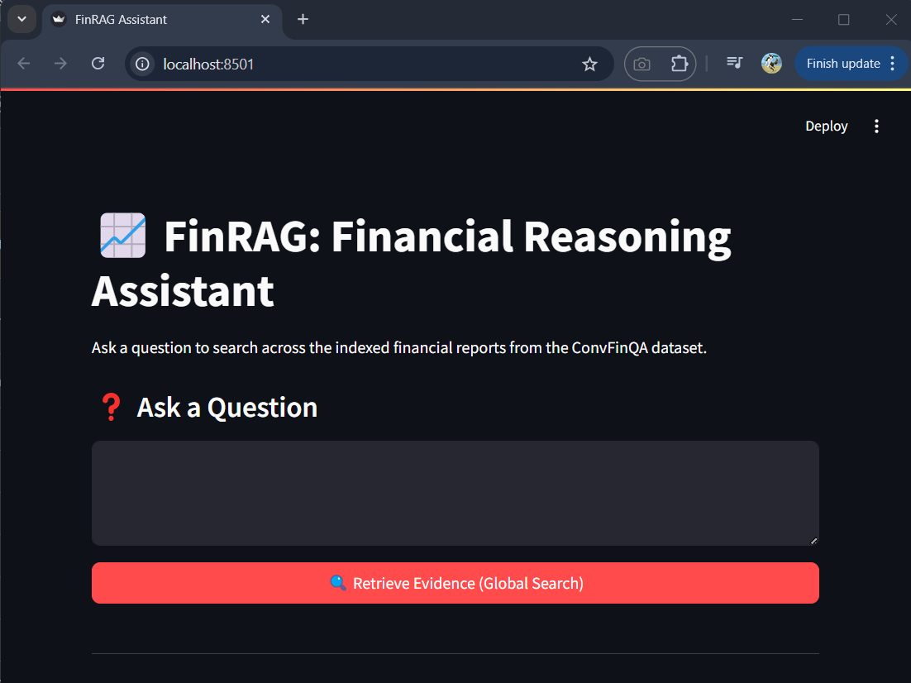

# FinRAG – Streamlit UI Walkthrough

This section provides a visual and functional overview of the FinRAG Streamlit demo application. The interface is designed for exploring financial question-answering with transparency into how the system retrieves context, generates reasoning programs, and produces final answers.

---

## Purpose of the Demo

- Demonstrate a working LLM-driven QA system on financial reports
- Make internal steps (retrieval, reranking, , execution) transparent

---

## UI Screenshots

### 1. Initial View – Landing Interface

- **Title**: FinRAG: Financial Reasoning Assistant
- **Subtitle**: Ask a question to search across the indexed financial reports from the ConvFinQA dataset.
- **Input Field**:  Ask a Question



---

### 2. Retrieval Stage

- Shows:
  - Top-k retrieved chunks before reranking (Embeddings retrieval from Vectore DB)
  - Reranked chunks (via Cohere)
  - Document source and type (text/table/row)
- Each chunk shows:
  - Document ID
  - Content type: `text`, `table`, or `row` 
  - Position: `pre` or `post` followed by sequence number
  - Relevance score: Floating point between 0-1 (e.g. `Score: 0.41`)
  - Content preview: First ~500 characters of the actual text content


---

### 3. Agent Results Display

- Displays the agent's final output after execution:
  - **Final Answer**: The computed answer, displayed prominently (e.g., using `st.metric` or `st.success`/`st.error`).
  - **Generated Program (Template)**: The Python expression template used for the calculation (e.g., `(VAL_1 - VAL_2) / VAL_2`).
  - **Intermediate Values**: The specific plan (required items map) and the extracted numerical values (or null) used in the calculation, shown as JSON.
  - **Raw Agent Result (Debug)**: The full raw output dictionary from the agent, available in a collapsed debug expander.


---

## Interactive Flow

1. User types a question.
2. User clicks "Retrieve Evidence (Global Search)".
3. System retrieves and reranks relevant evidence from the entire database (ChromaDB + Cohere).
4. UI displays retrieved evidence chunks.
5. User clicks "Run Agent with Evidence".
6. Agent performs two LLM steps:
   a. Specify Expression: Generates the calculation plan (required items, expression template).
   b. Extract Values: Extracts numbers for required items from the evidence.
7. Agent executes the expression using the extracted values.
8. UI presents the final results:
   - Final Answer
   - Generated Program Template
   - Intermediate Values
   - Raw Agent Result (Debug)

---

For a live walkthrough, launch the app locally:

```bash
poetry run streamlit run app.py
```

